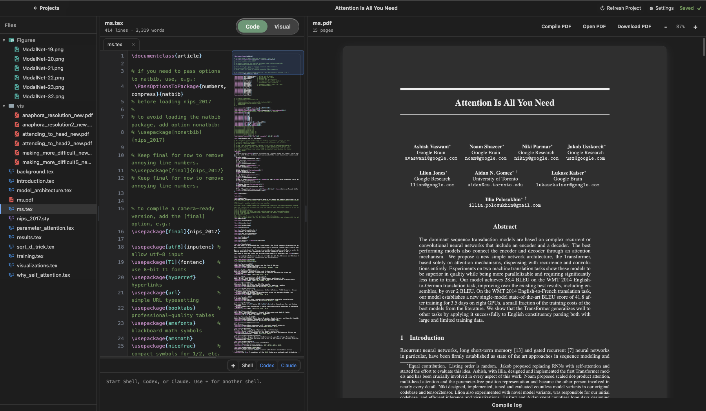

# Openleaf

Agent-native desktop workspace for LaTeX papers, PDFs, terminals, compile logs, and review workflows.



## Download and Run

Openleaf is currently distributed from this GitHub repository. Packaged
Windows and Linux installers are not published yet, so download the source
archive or clone the repository and run the Electron app locally.

### macOS App

To install Openleaf as a normal macOS application with its Dock icon:

```bash
git clone https://github.com/axel-slid/openleaf.git
cd openleaf
npm install
npm run install:mac
open /Applications/Openleaf.app
```

You can also install the GitHub package globally and run the explicit app
installer command:

```bash
npm install -g github:axel-slid/openleaf
openleaf install
openleaf open
```

`npm install` does not silently copy anything into `/Applications`. Use
`openleaf install` or `npm run install:mac` when you want the app bundle
created and installed. Once Openleaf is open, right-click its Dock icon and
choose **Options** > **Keep in Dock**.

Useful package commands:

```bash
npm run make:icons
npm run package:mac
npm run install:mac
openleaf package
openleaf install
openleaf open
```

### Windows

Requirements:

- Windows 10 or later.
- [Node.js LTS](https://nodejs.org/) with npm.
- [Git for Windows](https://git-scm.com/download/win), if you want to clone
  instead of downloading the ZIP.
- A LaTeX compiler on your `PATH` for PDF compilation. Openleaf tries
  `tectonic`, then `latexmk`, then `pdflatex`.

Download with the GitHub ZIP:

1. Open https://github.com/axel-slid/openleaf.
2. Click **Code** > **Download ZIP**.
3. Extract the ZIP.
4. Open PowerShell in the extracted folder.
5. Run:

```powershell
npm install
npm start
```

Or clone with Git:

```powershell
git clone https://github.com/axel-slid/openleaf.git
cd openleaf
npm install
npm start
```

### Linux

Requirements:

- Node.js LTS with npm.
- Git, if you want to clone instead of downloading the ZIP.
- A LaTeX compiler on your `PATH` for PDF compilation. Openleaf tries
  `tectonic`, then `latexmk`, then `pdflatex`.
- If `npm install` fails while building native dependencies, install your
  distro's Python 3, `make`, and C++ compiler packages.

Download with the GitHub ZIP:

1. Open https://github.com/axel-slid/openleaf.
2. Click **Code** > **Download ZIP**.
3. Extract the ZIP.
4. Open a terminal in the extracted folder.
5. Run:

```bash
npm install
npm start
```

Or clone with Git:

```bash
git clone https://github.com/axel-slid/openleaf.git
cd openleaf
npm install
npm start
```

## Local Development

```bash
cd openleaf
npm install
npm start
```

The app opens to a project library. **Add Project** lets you start a blank project or import a `.tex`, folder, `.zip`, `.tar`, `.tar.gz`, or `.tgz` project. Opening a project shows the source editor on the left and a rendered PDF preview on the right. The source editor has line numbers, LaTeX syntax coloring, wrapped lines, optional Vim shortcuts, and multiple text tabs. With **Auto compile** enabled, edits are saved, compiled with `tectonic`, and pushed into the PDF preview after a short pause.

Use **Code** for raw LaTeX editing and **Visual** for page-like paragraph editing that writes back into the LaTeX source. Drag the dividers to resize the files, editor, PDF, terminal, and compile-log panes, and use the settings modal for themes, PDF rendering, keyboard shortcuts, profile details, and AGENTS.md.
