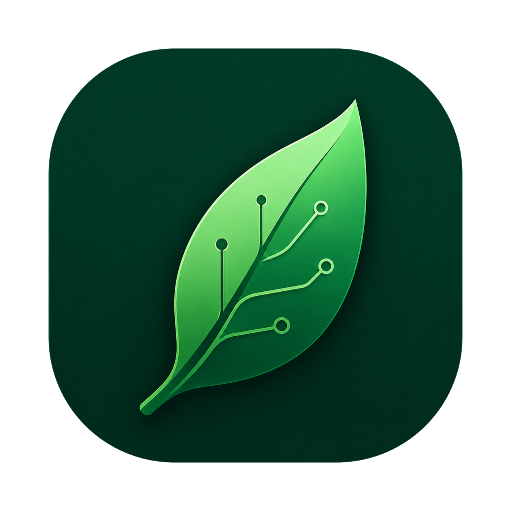

<div align="center">
  

  # Openleaf

  **An agent-native desktop studio for papers, slides, code, and review.**

  LaTeX + live PDF · Editable PowerPoint · Python notebooks · Local + SSH agents

  [](https://github.com/axel-slid/openleaf/releases/tag/v0.2.0)
  [](https://github.com/axel-slid/openleaf/releases/latest)
  [](https://www.electronjs.org/)
  [](https://github.com/axel-slid/openleaf/actions/workflows/build-release.yml)

  [Download](https://github.com/axel-slid/openleaf/releases/latest) ·
  [Feature reference](docs/features.md) ·
  [Release notes](docs/release-v0.2.0.md)
</div>

---


Openleaf keeps a research project in one coherent desktop workspace. Edit raw
LaTeX or page-like text, compile into a live PDF, work directly in native
PowerPoint files, run Python cells, and open shell, Codex, Claude, or SSH
terminals without losing the document you are reviewing.

## What makes Openleaf different

| Surface | What it does |
| --- | --- |
| **Paper workspace** | Project files, multi-tab LaTeX source, Code and Visual modes, minimap, Vim shortcuts, live PDF, compile log, and resizable panes |
| **PowerPoint editor** | Opens `.pptx` as an editable project with native text formatting, shapes, movement, resizing, presentation mode, direct save, and automatic backups |
| **Python workspace** | Opens `.py` and `.ipynb`, discovers interpreters, runs or traces cells in a persistent kernel, and keeps output beside the source |
| **Agent terminals** | Shell, Codex, Claude, and SSH sessions share the same project and its `AGENTS.md` instructions |
| **Remote projects** | Mirrors an SSH workspace locally for editing and preview while retaining remote terminal and Git workflows |
| **Review + history** | Compile diagnostics, file previews, selection-to-agent edits, project history, GitHub push/pull, and portable project exports |

## Highlights

- Fast local compilation through `tectonic`, `latexmk`, or `pdflatex`.
- Auto compile with a refreshed PDF preview after source changes.
- Code and structured Visual editing that both write to the same LaTeX source.
- `.ppt` and `.pptx` slide preview through LibreOffice.
- Native `.pptx` project editing with an untouched backup before every save.
- Persistent Python kernels with Run Cell, Run Above, Debug Cell, and Stop.
- Local and SSH workspaces with GitHub push/pull actions.
- Multiple shell tabs plus dedicated Codex and Claude launchers.
- Searchable theme gallery spanning light, dark, glass, and high-contrast looks.
- Project templates, command palette, Vim mode, minimap, and `AGENTS.md` editor.
- Archive import for `.zip`, `.tar`, `.tar.gz`, and `.tgz` projects.

## Install

### macOS Apple Silicon

Download `Openleaf-macOS-arm64.zip` from the
[latest release](https://github.com/axel-slid/openleaf/releases/latest), unzip
it, and drag `Openleaf.app` to Applications.

You can also install the CLI directly from GitHub:

```bash
npm install -g github:axel-slid/openleaf
openleaf install
openleaf open
```

The CLI looks for `tectonic`, `latexmk`, or `pdflatex`. If none is available
and Homebrew is installed, it installs `tectonic`.

### Run from source

Requirements: Node.js 22+, npm 10+, and a LaTeX compiler for paper builds.
LibreOffice is optional and enables PowerPoint-to-PDF preview.

```bash
git clone https://github.com/axel-slid/openleaf.git
cd openleaf
npm install
npm start
```

Validate the source and regression checks:

```bash
npm run check
npm test
```

Build a local macOS application:

```bash
npm run package:mac
```

## Keyboard map

| Shortcut | Action |
| --- | --- |
| `⌘/Ctrl+P` | Open the command palette |
| `⌘/Ctrl+F` | Search the active source |
| `Shift+Enter` | Run the current Python cell |
| `:w` | Save in Vim mode |
| `:q` | Return to Projects in Vim mode |
| `:wq` or `:x` | Save and return to Projects |

## Architecture

```text
Renderer workspace
   │  narrow context-isolated API
   ▼
Electron preload
   │  validated IPC
   ▼
Main process
   ├── local + mirrored SSH files
   ├── LaTeX compilation + PDF preview
   ├── PowerPoint preview/editor + backups
   ├── Python kernels
   ├── PTY and agent terminals
   └── GitHub, history, and export services
```

## Security note

Shell and coding-agent terminals can modify the selected local or remote
workspace with the permissions of the launched CLI. Open trusted projects,
review `AGENTS.md`, and inspect agent changes before pushing them.

## Documentation

- [Complete feature breakdown](docs/features.md)
- [v0.2.0 release notes](docs/release-v0.2.0.md)
- [Remotion source for the README animation](marketing/remotion)

<div align="center">
  Built for research that moves between prose, code, figures, slides, and agents.
</div>
